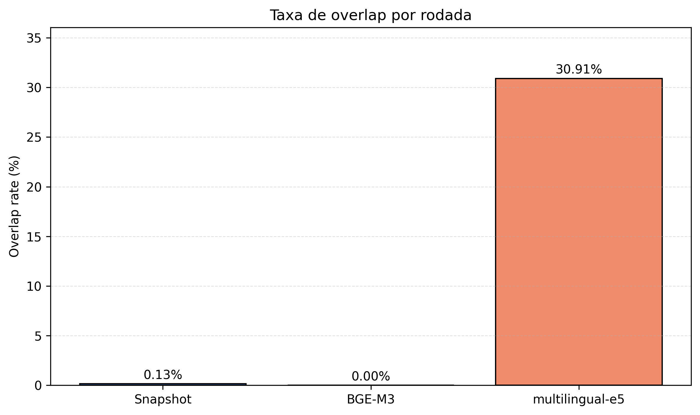
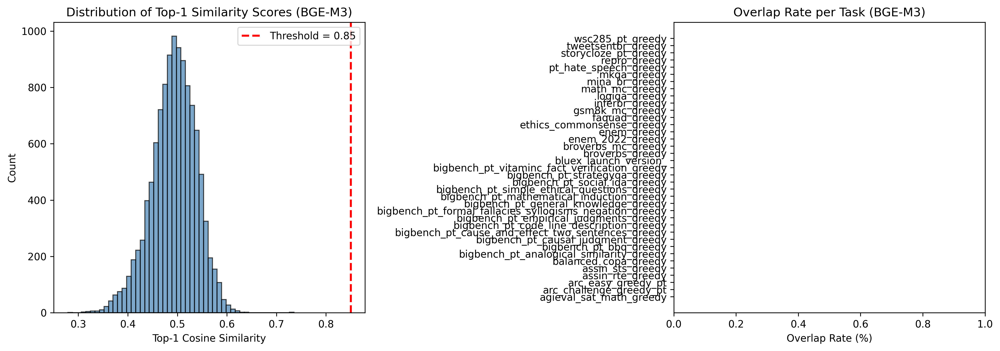
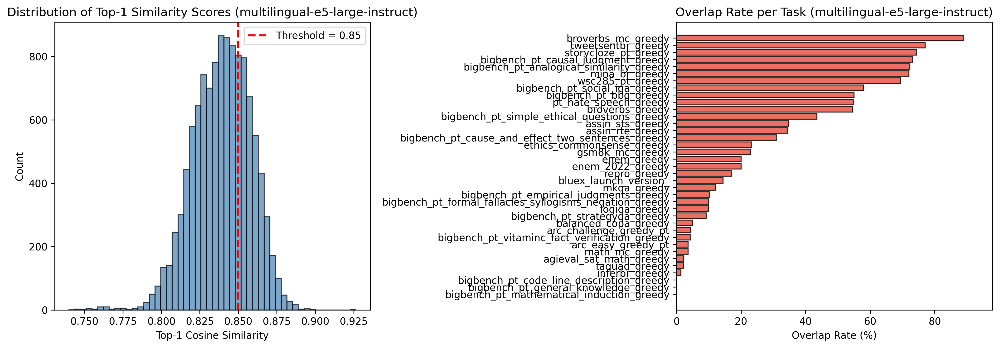

# Training-Eval Overlap: Carolina x PoetaV2

Este repositorio investiga o acoplamento entre o corpus Carolina, usado como base de treino em portugues, e o benchmark PoetaV2, usado para avaliar o modelo. A pergunta central nao e apenas "ha vazamento?", mas tambem "o avaliador esta suficientemente dissociado do universo do corpus para sustentar uma avaliacao confiavel?".

O pacote documental deste estudo agora tem dois niveis:

- `README.md`: resumo executivo, curto e visual.
- `RELATORIO_ACADEMICO_COMPLETO.md`: anexo tecnico completo, pronto para orientador e grupo de pesquisa.

## Resumo Executivo

O estudo encontrou um resultado metodologicamente forte: a leitura sobre overlap Carolina x PoetaV2 mudou drasticamente conforme o encoder utilizado. O snapshot inicial com modelo ingles indicou sinal baixo, o rerun com `BAAI/bge-m3` zerou no threshold herdado (`0.85`), e o rerun com `multilingual-e5-large-instruct` explodiu para `30,91%`. A conclusao correta nao e "nao ha problema" nem "ha contaminacao confirmada", mas sim que o estudo e altamente sensivel a modelo, threshold e preprocessamento, o que exige calibracao e validacao manual antes de qualquer afirmacao forte.

## Rodadas Executadas

| Rodada | Modelo | Objetivo da rodada | Docs Carolina | Instancias PoetaV2 | Threshold | Overlaps | Taxa | Tasks com overlap > 0 | Caps e truncation |
| --- | --- | --- | ---: | ---: | ---: | ---: | ---: | ---: | --- |
| Snapshot exploratorio | `BAAI/bge-small-en-v1.5` | Verificar viabilidade do pipeline com run rapida inicial | 993 | 11.409 | 0,85 | 15 | 0,13% | 10/37 | `MAX_CAROLINA_DOCS=1000`; `MAX_INSTANCES_PER_TASK=500`; sem truncation explicita |
| Rerun multilingue principal | `BAAI/bge-m3` | Repetir o estudo com encoder retrieval-oriented realmente multilingue | 993 | 11.409 | 0,85 | 0 | 0,00% | 0/37 | `MAX_CAROLINA_DOCS=1000`; `MAX_INSTANCES_PER_TASK=500`; `max_seq_length=512`; `max_document_chars=2000` |
| Rerun multilingue alternativo | `intfloat/multilingual-e5-large-instruct` | Testar alternativa multilingue com query instruction explicita | 993 | 11.409 | 0,85 | 3.527 | 30,91% | 34/37 | `MAX_CAROLINA_DOCS=1000`; `MAX_INSTANCES_PER_TASK=500`; `max_seq_length=512`; `max_document_chars=2000` |

Tabela consolidada em `results/tables/study_run_summary.csv`.

## Principais Conclusoes

- O estudo nao sustenta uma conclusao simples sobre contaminacao; ele sustenta uma conclusao forte sobre sensibilidade metodologica.
- O snapshot inicial ingles apontou baixo sinal (`15/11.409`), mas ele nao era adequado como evidencia final para portugues.
- O `BAAI/bge-m3` nao produziu nenhum caso acima de `0,85`; isso mostra que o threshold herdado ficou acima do suporte observado nessa rodada.
- O `multilingual-e5-large-instruct` produziu `3.527` casos acima de `0,85`, mas com forte concentracao em poucos documentos Carolina e em textos que parecem dialogos, legendas e transcricoes genericas.
- A combinacao "mesmo threshold para todos os modelos" nao e defensavel aqui sem calibracao supervisionada por modelo.
- O principal achado do estudo e que a avaliacao Carolina x PoetaV2 precisa de uma auditoria mais robusta antes de sustentar inferencias sobre capacidade geral do modelo.

## Por Que Fizemos Novas Rodadas Multilingues

As rodadas novas foram necessarias por uma preocupacao central de validade linguistica:

- o snapshot inicial usou `bge-small-en-v1.5`, um baseline rapido e ingles-centrado;
- o corpus Carolina e o benchmark PoetaV2 sao, em grande parte, portugueses;
- portanto, era metodologicamente importante repetir o estudo com encoders multilingues de retrieval mais adequados ao dominio linguistico da analise.

O rerun recente tambem exigiu ajustes explicitos de throughput para rodar de forma reproduzivel em GPU local:

- os documentos Carolina sao muito longos em forma bruta;
- `bge-m3` vinha com `max_seq_length` alto demais para uma execucao local confortavel;
- por isso a rodada local foi registrada com truncation explicita: `max_seq_length=512` e `max_document_chars=2000`.

## Leitura Correta Dos Resultados

**O que os dados sugerem**

- O benchmark e altamente sensivel ao encoder e ao threshold escolhido.
- A proximidade semantica observada entre Carolina e PoetaV2 pode estar sendo inflada, em parte, por material narrativo generico e ruidoso presente no Carolina.
- O threshold `0,85` nao mede a mesma coisa em `bge-m3` e `multilingual-e5-large-instruct`.

**O que os dados ainda nao provam**

- Nao provam que PoetaV2 esteja "limpo".
- Nao provam que PoetaV2 esteja "contaminado".
- Nao provam que os `3.527` casos do `e5` sejam vazamento real.
- Nao provam que `0` casos no `bge-m3` impliquem ausencia de proximidade semantica relevante.

## Visual Resumido

Comparacao direta da taxa de overlap entre as tres rodadas:



Distribuicoes por rodada:

- Snapshot exploratorio: 
- `BAAI/bge-m3`: 
- `multilingual-e5-large-instruct`: 

Artefatos visuais adicionais:

- Heatmap do snapshot: `results/figures/overlap_heatmap_snapshot.png`
- Heatmap `bge_m3`: `results/runs/bge_m3/figures/overlap_heatmap.png`
- Heatmap `multilingual_e5_large_instruct`: `results/runs/multilingual_e5_large_instruct/figures/overlap_heatmap.png`

## Tabelas-Chave

- Consolidado das rodadas: `results/tables/study_run_summary.csv`
- Sensibilidade por threshold: `results/tables/threshold_sensitivity_summary.csv`
- Top hub documents do `e5`: `results/tables/e5_hub_documents.csv`
- Maiores deltas por task entre `bge_m3` e `e5`: `results/tables/top_task_deltas_summary.csv`
- Comparacao completa entre runs: `results/runs/comparison/model_comparison.md`

## Limitacoes Principais

- O estudo ainda usa apenas `993` documentos Carolina, nao o corpus completo.
- Cada task PoetaV2 foi truncada em `500` instancias no snapshot e nos reruns recentes.
- Apenas `37` de `43` tasks foram carregadas com sucesso.
- O snapshot inicial usou um encoder rapido ingles-centrado.
- Os reruns locais multilingues usam truncation explicita, o que melhora throughput mas muda a unidade efetiva de comparacao.
- Ainda nao ha calibracao supervisionada do threshold por modelo.
- Similaridade alta continua sendo apenas um sinal de suspeita; nao equivale a contaminacao confirmada.

## Proximos Passos

- Calibrar threshold por modelo com amostra anotada manualmente.
- Trocar truncation simples por chunking em passagens.
- Repetir a auditoria no corpus Carolina completo.
- Remover o cap de `500` instancias por task.
- Corrigir ou substituir as `6` tasks que falharam no carregamento.
- Agrupar benchmarks por familia para nao tratar variantes proximas como evidencias independentes.

## Arquivos Principais

- Anexo tecnico completo: `RELATORIO_ACADEMICO_COMPLETO.md`
- Relatorio historico do snapshot inicial: `RELATORIO_ACADEMICO_SNAPSHOT.md`
- Notebook exploratorio inicial: `notebooks/training_eval_overlap.ipynb`
- Notebook rerun multilingue: `notebooks/training_eval_overlap_multilingual_rerun.ipynb`
- Script que gera as tabelas e figura consolidadas do estudo: `scripts/build_study_report_artifacts.py`

## Reproducao

Ambiente local:

```powershell
cd training-eval-overlap
.\env_eval_overlap\Scripts\Activate.ps1
poetry install --extras dev
```

Para reconstruir os artefatos consolidados do relatorio:

```powershell
python scripts/build_study_report_artifacts.py
```

Para rerodar o notebook multilingue:

- selecione o kernel `Python (env_eval_overlap)`;
- abra `notebooks/training_eval_overlap_multilingual_rerun.ipynb`;
- rode o notebook do topo.

## Observacao Final

Este repositorio agora registra um resultado importante para o projeto: antes de usar PoetaV2 como evidencia forte de melhoria do modelo treinado em Carolina, e preciso auditar com mais rigor o quanto essa avaliacao depende do encoder, do threshold e da forma como o corpus Carolina e apresentado ao sistema de busca semantica.
