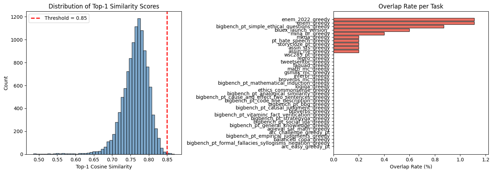
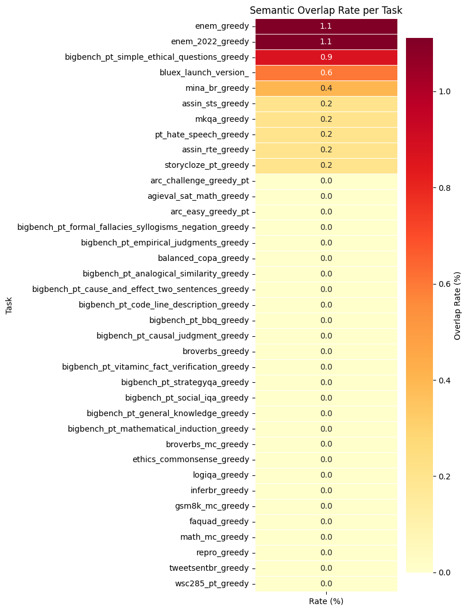

# Training-Eval Overlap: Carolina x PoetaV2

This repository audits possible benchmark contamination between the Carolina corpus and PoetaV2 evaluation tasks.

The current codebase has two complementary entry points:

- `notebooks/training_eval_overlap.ipynb` runs the end-to-end exploratory Colab workflow, including Carolina download, PoetaV2 task loading, FAISS retrieval, plots, and report tables.
- `scripts/run_semantic_search.py` and `scripts/run_pipeline.py` provide reusable local CLI entry points once Carolina and PoetaV2 data are available on disk.

> Current committed snapshot: the notebook quick run indexed 993 Carolina documents, searched 11,409 PoetaV2 instances from 37 tasks, and flagged 15 instances above cosine similarity 0.85 (0.13% overall).

## Snapshot At a Glance

The numbers below come from the executed notebook currently committed in this repository.

| Metric | Value |
| --- | --- |
| Carolina documents indexed | 993 |
| PoetaV2 tasks attempted | 43 |
| Tasks loaded successfully | 37 |
| Tasks that failed to load | 6 |
| Evaluation instances searched | 11,409 |
| Embedding model used in the notebook snapshot | `BAAI/bge-small-en-v1.5` |
| Retrieval backend | FAISS top-5 nearest neighbors |
| Overlap threshold | cosine similarity `>= 0.85` |
| Flagged overlaps | 15 |
| Overall overlap rate | 0.13% |
| 95% bootstrap CI | [0.07%, 0.20%] |
| Mean top-1 similarity | 0.763 |

## What the Current Results Say

- The observed overlap signal is low in this quick run: only 15 of 11,409 evaluation instances crossed the similarity threshold.
- 27 of the 37 loaded tasks had zero flagged examples.
- The highest overlap rates were in `enem_greedy` and `enem_2022_greedy` with 2 flagged items each out of 180 instances (1.11%).
- `bluex_launch_version_` had the largest absolute count of flagged items: 3 out of 500.
- Manual inspection of the top-ranked matches suggests many hits are weak semantic neighbors or false positives, not obvious verbatim leakage.

## Visual Snapshot

Top-1 similarity distribution and per-task overlap rates:



Per-task heatmap:



## Tasks With Non-Zero Flagged Overlap

| Task | Flagged | Total | Rate | 95% CI |
| --- | ---: | ---: | ---: | --- |
| `enem_greedy` | 2 | 180 | 1.11% | [0.00%, 2.78%] |
| `enem_2022_greedy` | 2 | 180 | 1.11% | [0.00%, 2.78%] |
| `bigbench_pt_simple_ethical_questions_greedy` | 1 | 115 | 0.87% | [0.00%, 2.61%] |
| `bluex_launch_version_` | 3 | 500 | 0.60% | [0.00%, 1.40%] |
| `mina_br_greedy` | 2 | 500 | 0.40% | [0.00%, 1.00%] |
| `assin_sts_greedy` | 1 | 500 | 0.20% | [0.00%, 0.60%] |
| `mkqa_greedy` | 1 | 500 | 0.20% | [0.00%, 0.60%] |
| `pt_hate_speech_greedy` | 1 | 500 | 0.20% | [0.00%, 0.60%] |
| `assin_rte_greedy` | 1 | 500 | 0.20% | [0.00%, 0.60%] |
| `storycloze_pt_greedy` | 1 | 500 | 0.20% | [0.00%, 0.60%] |

The full snapshot table is available in `results/tables/overlap_summary_snapshot.csv`.

## Examples From Manual Inspection

The notebook exported the top-20 most suspicious matches for qualitative review. A few representative examples:

| Task | Similarity | Qualitative read |
| --- | ---: | --- |
| `bluex_launch_version_` | 0.8696 | Literary benchmark prompt matched unrelated narrative prose from Carolina. |
| `mina_br_greedy` | 0.8585 | Toxic social-media style text matched subtitle-like dialogue from a different source. |
| `storycloze_pt_greedy` | 0.8548 | Christmas mini-story matched a Futurama subtitle fragment about Christmas. |
| `enem_greedy` | 0.8574 | An ENEM reading excerpt matched anime-style subtitle text rather than an obvious duplicate. |

This matters because the current threshold is good for recall, but manual inspection is still necessary before labeling a hit as true contamination.

The raw top-20 snapshot is stored in `results/tables/top20_suspicious_matches_snapshot.csv`.

## Failed Task Loads in the Notebook Run

Six tasks did not load in the current exploratory run because some Hugging Face datasets still depend on deprecated dataset scripts or `trust_remote_code` behavior:

- `agnews_pt_greedy`
- `boolq_pt_greedy`
- `imdb_pt_greedy`
- `sst2_pt_greedy`
- `hatebr_binary_greedy`
- `massive_greedy`

## Repository Layout

```text
training-eval-overlap/
|-- configs/
|-- data/
|-- notebooks/
|   `-- training_eval_overlap.ipynb
|-- results/
|   |-- figures/
|   `-- tables/
|-- scripts/
|-- src/contamination/
`-- tests/
```

## Reproduce the Notebook Snapshot

Install the project:

```bash
pip install -e ".[dev]"
```

Open the notebook:

```bash
jupyter notebook notebooks/training_eval_overlap.ipynb
```

Important notebook settings in the current snapshot:

- `MAX_CAROLINA_DOCS = 1000`
- `MAX_INSTANCES_PER_TASK = 500`
- `SIMILARITY_THRESHOLD = 0.85`
- `EMBEDDING_MODEL = "BAAI/bge-small-en-v1.5"`

For a fuller audit, rerun with:

- `MAX_CAROLINA_DOCS = None`
- `MAX_INSTANCES_PER_TASK = None`
- `EMBEDDING_MODEL = "BAAI/bge-m3"` or another stronger multilingual encoder

The notebook expects internet access and, in some environments, a valid `HF_TOKEN` for smoother dataset access.

## Run the Local CLI Pipeline

Copy the default config and point it to local Carolina and PoetaV2 directories:

```bash
cp configs/default.yaml configs/local.yaml
```

Then run semantic search:

```bash
python scripts/run_semantic_search.py --config configs/local.yaml --model BAAI/bge-m3
```

Optional complementary n-gram pipeline:

```bash
python scripts/run_pipeline.py --config configs/local.yaml
```

Note: the notebook currently contains the most complete PoetaV2 task-loading logic. The local CLI assumes your benchmark files already exist in a local directory layout that `src/contamination/extraction.py` can read.

## Committed Snapshot Artifacts

These files were added to make the current result snapshot visible directly on GitHub:

- `results/figures/overlap_distribution_snapshot.png`
- `results/figures/overlap_heatmap_snapshot.png`
- `results/tables/overlap_summary_snapshot.csv`
- `results/tables/top20_suspicious_matches_snapshot.csv`

## Current Limitations

- This is not yet a full-corpus audit. The committed notebook snapshot uses only the first 1,000 streamed Carolina documents, of which 993 passed the minimum-length filter.
- The notebook snapshot uses `BAAI/bge-small-en-v1.5` for speed on Colab. The packaged CLI defaults to `BAAI/bge-m3`.
- Six benchmark tasks failed to load because of upstream dataset-loader restrictions.
- High similarity alone is not enough to prove contamination; the most suspicious hits still require manual review.

## Next Recommended Step

Rerun the full audit with the complete Carolina corpus, no per-task cap, and a stronger multilingual embedding model. That will turn this repository from a strong exploratory snapshot into a publishable contamination analysis baseline.
